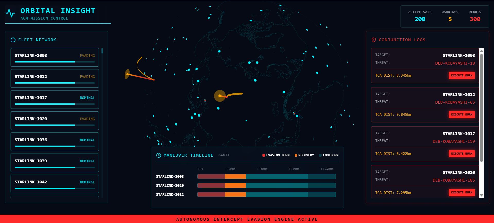

<div id="top"></div>

<div align="center">

[](https://github.com/D3vanshUSha4mA/Orbital-Debris-Avoidance-Constellation-Management-System/graphs/contributors)
[](https://github.com/D3vanshUSha4mA/Orbital-Debris-Avoidance-Constellation-Management-System/network/members)
[](https://github.com/D3vanshUSha4mA/Orbital-Debris-Avoidance-Constellation-Management-System/stargazers)
[](https://github.com/D3vanshUSha4mA/Orbital-Debris-Avoidance-Constellation-Management-System/issues)
[](https://github.com/D3vanshUSha4mA/Orbital-Debris-Avoidance-Constellation-Management-System/blob/main/LICENSE)

<br>

# 🛰️ AETHER

### Autonomous Constellation Manager

### Real-Time Orbital Collision Avoidance & Fleet Management System

*A full-stack mission control platform capable of ingesting live satellite telemetry, predicting future conjunctions, autonomously planning collision avoidance maneuvers, and visualizing orbital environments in real time.*

<br>



*Replace this image with your dashboard screenshot or demo GIF.*

</div>

---

# Table of Contents

- [About The Project](#about-the-project)
- [Key Features](#key-features)
- [System Architecture](#system-architecture)
- [Physics & Algorithms](#physics--algorithms)
- [Performance](#performance)
- [Project Structure](#project-structure)
- [Screenshot](#screenshot)
- [Getting Started](#getting-started)
- [API Reference](#api-reference)
- [Future Improvements](#future-improvements)
- [License](#license)

---

# About The Project

Modern satellite constellations contain thousands of spacecraft operating within densely populated orbital shells. Predicting orbital conjunctions in real time requires continuously propagating trajectories, efficiently searching nearby objects, and responding before potential collisions occur.

**AETHER** is a real-time orbital collision avoidance system that combines orbital mechanics, numerical integration, spatial indexing, asynchronous backend services, and an interactive 3D visualization dashboard into a unified mission-control platform.

The system continuously streams live satellite telemetry, predicts future conjunctions using Runge-Kutta integration, detects potential collisions through KD-Tree spatial partitioning, and autonomously executes avoidance maneuvers whenever predefined safety thresholds are exceeded.

---

# Key Features

## 🛰️ Live Telemetry Ingestion

- Fetches live Starlink TLEs directly from Celestrak
- Continuous 1 Hz telemetry updates
- Skyfield-based orbital propagation
- Real-time position and velocity computation

---

## ☄️ Synthetic Debris Simulation

Generates dynamic fragmentation clouds for stress-testing collision detection algorithms.

Features include:

- Targeted debris generation
- Configurable cloud sizes
- Dynamic trajectories
- Real-time visualization

---

## 📡 Predictive Orbital Physics

Predicts future satellite positions using high-precision numerical integration.

Includes:

- RK4 orbital propagation
- 24-hour conjunction prediction
- Future trajectory simulation
- Continuous state updates

---

## ⚠️ Collision Detection Engine

Efficiently detects conjunctions using spatial indexing.

Features:

- SciPy cKDTree
- Nearest-neighbor search
- Immediate collision detection
- Future conjunction analysis

---

## 🚀 Autonomous Collision Avoidance

When conjunction thresholds are exceeded, the engine automatically computes avoidance maneuvers.

Current implementation:

- Automatic orbital altitude adjustment
- Safety threshold monitoring
- Dynamic trajectory modification

---

## 🌍 Interactive Mission Control Dashboard

Modern WebGL visualization powered by React.

Includes:

- Interactive Earth model
- Satellite visualization
- Debris rendering
- Live conjunction logs
- Real-time telemetry updates

---

# System Architecture

The platform is divided into three independent services to maximize responsiveness and maintain real-time performance.

---

## 1. Telemetry Streamer

Acts as the external tracking station.

Responsibilities:

- Download Starlink TLEs
- Propagate orbital states
- Generate synthetic debris
- Sanitize invalid numerical values
- Stream telemetry every second

---

## 2. FastAPI Backend

Serves as the mission-control engine.

Responsibilities:

- High-throughput telemetry ingestion
- Immediate collision detection
- Future prediction engine
- Autonomous maneuver planning

Performance optimizations include:

- Raw byte request parsing
- Background prediction tasks
- Deep-copy simulation states
- GIL yielding during heavy computations

---

## 3. React Dashboard

Mission-control interface providing:

- 3D Earth visualization
- Satellite tracking
- Debris rendering
- Conjunction monitoring
- Fleet management

Technology Stack:

- React
- Tailwind CSS
- React Three Fiber
- Zustand

---

# Physics & Algorithms

## Runge-Kutta 4th Order (RK4)

Future orbital positions are computed using fourth-order Runge-Kutta numerical integration.

Advantages:

- High numerical accuracy
- Stable orbital propagation
- Low accumulated integration error
- Accurate long-term trajectory prediction

---

## KD-Tree Spatial Partitioning

Checking every object against every other object requires

```math
O(N^2)
```

comparisons.

Instead, AETHER organizes orbital objects inside a SciPy cKDTree, reducing the search complexity to

```math
O(N \log N)
```

allowing thousands of orbital objects to be processed efficiently.

---

## Data Sanitization

Orbital propagation occasionally produces invalid numerical values caused by decaying trajectories or floating-point instability.

Before transmission, every payload is recursively sanitized by replacing:

- NaN
- Infinity
- Invalid floating-point values

ensuring reliable JSON serialization.

---

# Performance

Current development configuration

| Metric | Value |
|---------|-------|
| Satellites | 200 |
| Debris | 300 |
| Total Objects | 500 |
| Update Frequency | 1 Hz |
| Prediction Window | 24 Hours |

---

## Scalability

The mathematical engine has been tested with simulations containing over **10,000 orbital objects**.

Current bottlenecks originate primarily from:

- Large JSON payload transmission
- Windows ↔ WSL2 networking overhead
- HTTP polling latency

The underlying collision detection algorithm remains scalable due to KD-Tree spatial indexing.

---

# Project Structure

```text
Orbital-Debris-Avoidance-Constellation-Management-System/

│
├── backend/
│   ├── api/
│   ├── physics/
│   ├── models/
│   ├── services/
│   ├── main.py
│   └── requirements.txt
│
├── frontend/
│   ├── src/
│   ├── components/
│   ├── store/
│   ├── public/
│   └── package.json
│
├── live_streamer.py
│
├── images/
│   └── showcase.png
│
├── README.md
│
└── LICENSE
```

---

# Screenshot

<p align="center">


</p>

---

# Getting Started

## Prerequisites

- Python 3.10+
- Node.js 18+
- Git

---

## Clone Repository

```bash
git clone https://github.com/D3vanshUSha4mA/Orbital-Debris-Avoidance-Constellation-Management-System.git
```

---

## Backend Setup

```bash
cd backend

python -m venv venv

# Windows
venv\Scripts\activate

# Linux/macOS
source venv/bin/activate

pip install -r requirements.txt

uvicorn main:app --host 127.0.0.1 --port 8000
```

Backend documentation:

```
http://127.0.0.1:8000/docs
```

---

## Frontend Setup

```bash
cd frontend

npm install

npm start
```

Open:

```
http://localhost:3000
```

---

## Start Live Telemetry Streamer

```bash
python live_streamer.py
```

The dashboard will begin rendering satellites, debris objects, and conjunction warnings in real time.

---

# API Reference

## POST `/api/telemetry`

Receives live orbital telemetry.

Example payload:

```json
{
  "timestamp": "2026-06-29T15:23:46Z",
  "objects": [
    {
      "id": "STARLINK-1008",
      "type": "satellite",
      "r": {
        "x": 4200.1,
        "y": -1200.4,
        "z": 5500.9
      },
      "v": {
        "x": 7.4,
        "y": -1.2,
        "z": 0.8
      }
    }
  ]
}
```

---

## GET `/api/visualization/snapshot`

Returns the latest visualization state.

Example response:

```json
{
  "timestamp": "...",
  "satellites": [],
  "debris": [],
  "warnings": []
}
```

---

# Future Improvements

Planned enhancements include:

- WebSocket-based telemetry streaming
- Multi-constellation support
- GPU-accelerated orbital propagation
- Distributed simulation workers
- Machine learning-based conjunction prediction
- Interactive maneuver planning
- Historical replay mode
- Space weather integration
- Cloud-native deployment

---

# License

Distributed under the MIT License.

See the `LICENSE` file for more information.

---

<div align="center">

## Built With

**Python • FastAPI • React • Tailwind CSS • React Three Fiber • Skyfield • SciPy • NumPy • Zustand • Docker**

</div>